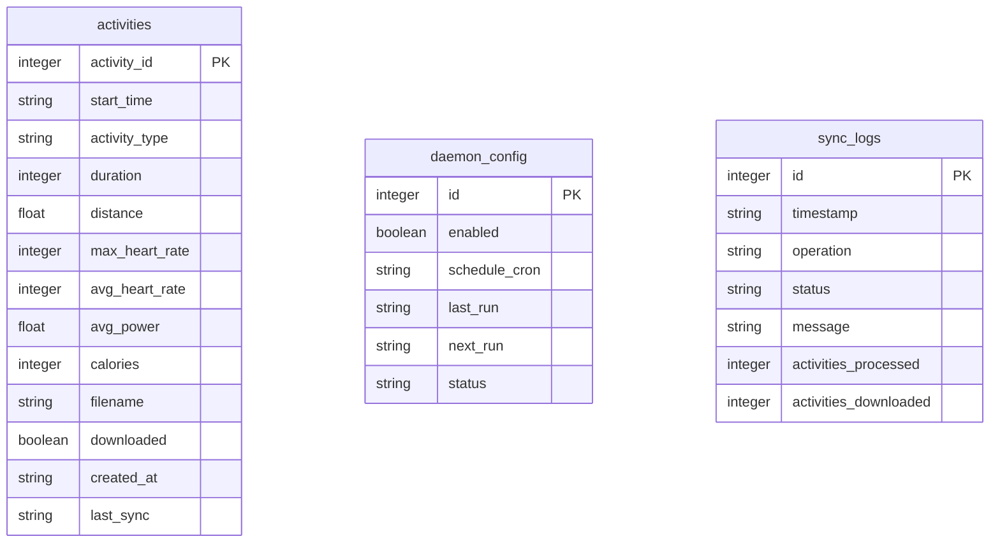

# GarminSync Workflows

## Migration Workflow

### Purpose
Add new columns to database and populate with activity metrics

### Trigger
`python cli.py migrate`

### Steps
1. Add required columns to activities table:
   - activity_type (TEXT)
   - duration (INTEGER)
   - distance (REAL)
   - max_heart_rate (INTEGER)
   - avg_power (REAL)
   - calories (INTEGER)
2. For each activity:
   - Parse metrics from local FIT/XML files
   - Fetch from Garmin API if local files missing
   - Update database fields
3. Commit changes
4. Report migration status

### Error Handling
- Logs errors per activity
- Marks unprocessable activities as "Unknown"
- Continues processing other activities on error

## Sync Workflow

### Purpose
Keep local database synchronized with Garmin Connect

### Triggers
- CLI commands (`list`, `download`)
- Scheduled daemon (every 6 hours by default)
- Web UI requests

### Core Components
- `sync_database()`: Syncs activity metadata
- `download()`: Fetches missing FIT files
- Daemon: Background scheduler and web UI

### Process Flow
1. Authenticate with Garmin API
2. Fetch latest activities
3. For each activity:
   - Parse metrics from FIT/XML files
   - Fetch from Garmin API if local files missing
   - Update database fields
4. Download missing activity files
5. Update sync timestamps
6. Log operations

### Database Schema

### Key Notes
- Data directory: `data/` (configurable via DATA_DIR)
- Web UI port: 8080 (default)
- Downloaded files: `activity_{id}_{timestamp}.fit`
- Metrics include: heart rate, power, calories, distance
